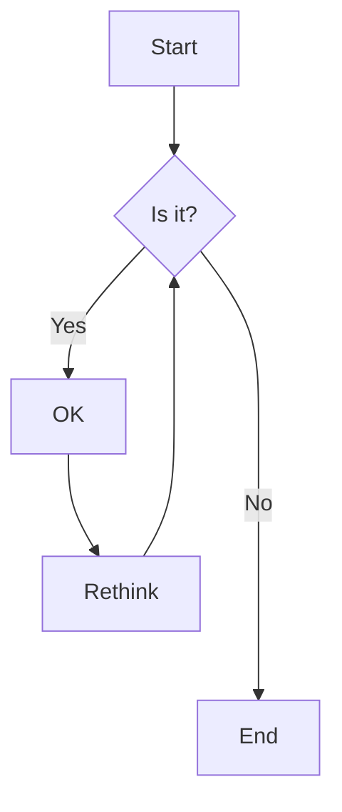

# Markdown Test File

This file demonstrates all common markdown features.

[Link to test](https://www.google.com)

## Text Formatting

_Italic text_ and _also italic text_

**Bold text** and **also bold text**

**_Bold and italic_** and **_also bold and italic_**

~~Strikethrough text~~

This is an additional paragraph that provides more context to the Markdown Test File. It serves as an example of how to include paragraphs in your markdown content, demonstrating the ability to format text in a readable manner.

Here is another paragraph that can be used to elaborate on the features of markdown. Markdown allows for easy formatting of text, making it a popular choice for documentation and content creation. You can easily create lists, links, and even buttons, as shown in the sections below.

## Headers

# H1

## H2

### H3

#### H4

##### H5

###### H6

## Buttons

<button class="btn btn-soft">Default</button>
<button class="btn btn-soft btn-primary">Primary</button>
<button class="btn btn-soft btn-secondary">Secondary</button>
<button class="btn btn-soft btn-accent">Accent</button>
<button class="btn btn-soft btn-info">Info</button>
<button class="btn btn-soft btn-success">Success</button>
<button class="btn btn-soft btn-warning">Warning</button>
<button class="btn btn-soft btn-error">Error</button>
<button class="btn btn-ghost">Ghost</button>
<button class="btn btn-link">Link</button>

## Link Buttons

<a
  href="https://example.com"
  target="_blank"
  class="btn-outline btn btn-accent"
>
  Visit Example.com
</a>

## Lists

### Unordered Lists

- Item 1
- Item 2
  - Subitem 2.1
  - Subitem 2.2
- Item 3

### Ordered Lists

1. First item
2. Second item
   1. Subitem 2.1
   2. Subitem 2.2
3. Third item

### Task Lists

- [x] Completed task
- [ ] Incomplete task
- [ ] Another task

## Links and Images

### Links

[Regular link](https://example.com)

[Link with title](https://example.com "Example Title")

### Images


## Code

### Inline Code

This is `inline code` example.

### Code Blocks

```javascript
function hello() {
  console.log("Hello, world!");
}
```

```python
def hello():
    print("Hello, world!")
```

## Tables

| Header 1 | Header 2 | Header 3 |
| -------- | -------- | -------- |
| Cell 1   | Cell 2   | Cell 3   |
| Cell 4   | Cell 5   | Cell 6   |

## Blockquotes

> This is a blockquote
>
> > This is a nested blockquote
>
> Back to the first level

## Horizontal Rules

---

—

---

—

---

—

## Bootstrap Icons <i class="bi bi-apple"></i>

<i class="bi-box-arrow-up-right bi" style="font-size: 3em;"></i>[
<i class="bi-box-arrow-down-right bi" style="font-size: 3em;"></i>](https://app.squareup.com/dashboard/shifts/timecards)

## iconify Icons

<i class="iconify-inline" data-icon="mdi:apple"></i>

<i class="iconify-inline" data-icon="majesticons:open" style="font-size: 2em;"></i>

[<i class="iconify-inline" data-icon="famicons:open-outline" style="font-size: 3em;"></i>](https://app.squareup.com/dashboard/shifts/timecards)

<svg xmlns="http://www.w3.org/2000/svg" width="36" height="36" viewBox="0 0 512 512">
  <path
    fill="none"
    stroke="currentColor"
    stroke-linecap="round"
    stroke-linejoin="round"
    stroke-width="32"
    d="M384 224v184a40 40 0 0 1-40 40H104a40 40 0 0 1-40-40V168a40 40 0 0 1 40-40h167.48M336 64h112v112M224 288L440 72"
  />
</svg>

## HTML (if supported)

### example 1

<div style="color: yellowgreen;">
  This is <b>HTML</b> content
</div>

### example 2 (Custom Card)

:::customcard1
{
"title": "Example Card 1",
"image": "https://cdn.midjourney.com/3fb5dc99-7314-43cb-8cb1-7a34a2488558/0_2.png",
"description": "This is an example of a custom card component with a primary color border.",
"badges": ["New", "Featured"],
"tags": ["Example", "Card", "DaisyUI"],
"width": 200,
"link": "https://www.duckduckgo.com",
"border": true,
"borderColor": "primary",
"group": "group1"
}
:::

:::customcard1
{
"title": "Example Card 2",
"description": "This is an example of a custom card component without an image and with a secondary color border.",
"image": "https://cdn.midjourney.com/fc46f1d5-1ae8-47e7-9ecb-4d947e67c15b/0_0.png",
"badges": ["New2", "Featured2"],
"tags": ["example2", "card2", "daisyUI2"],
"width": 200,
"link": "https://www.valtown.com",
"border": true,
"borderColor": "secondary",
"group": "group1"
}
:::

:::customcard1
{
"title": "Example Card 3",
"description": "This is an example of a custom card component with an accent color border.",
"image": "https://cdn.midjourney.com/3fb5dc99-7314-43cb-8cb1-7a34a2488558/0_2.png",
"badges": ["new3"],
"tags": ["example3", "card3"],
"width": 250,
"link": "https://www.duckduckgo.com",
"border": true,
"borderColor": "accent",
"group": "group2"
}
:::

:::customcard1
{
"title": "Example Card 4",
"description": "This is an example of a custom card component with a custom Tailwind color border.",
"image": "https://cdn.midjourney.com/1272f6de-08b0-45eb-a4f3-80f7e76c1c62/0_0.png",
"badges": ["new4"],
"tags": ["example4", "card4"],
"width": 250,
"border": true,
"borderColor": "orange-900 bg-blue-600/70",
"group": "group2"
}
:::

:::customcard1

```yaml
icon: mdi:apple
title: Example Card 5
description: "This is an example of a custom card component with a custom Tailwind color border"
image: https://cdn.midjourney.com/1272f6de-08b0-45eb-a4f3-80f7e76c1c62/0_0.png
badges:
  - new4
tags:
  - example4
  - card4
width: 250
border: true
borderColor: orange-900 bg-blue-600/70
group: group3
```

:::

### Container Blocks

:::cblock_info
This is an info box.
:::

:::cblock_success
This is a success box.
:::

:::cblock_warning
This is a warning box.
:::

:::cblock_danger
This is a danger box.
:::

### example 3 (Custom Card 2)

:::customcard2
{
"link": "https://x.com/OpenAi",
"imageSrc": "https://pbs.twimg.com/profile_images/1885410181409820672/ztsaR0JW_400x400.jpg",
"title": "OpenAi",
"description": "Follow OpenAI on X for updates!",
"icon": "simple-icons:x",
"width": "w-48",
"group": "Ai"
}
:::

:::customcard2
{
"link": "https://x.com/embirico",
"imageSrc": "https://pbs.twimg.com/profile_images/1649509163712561153/mTxQ1REO_400x400.jpg",
"title": "embirico",
"description": "Follow embirico on X for updates!",
"icon": "simple-icons:x",
"width": "w-48",
"group": "Ai"
}
:::

:::customcard2
{
"link": "https://x.com/sama",
"imageSrc": "https://pbs.twimg.com/profile_images/1904933748015255552/k43GMz63_400x400.jpg",
"title": "sama",
"description": "Follow sama on X for updates!",
"icon": "simple-icons:x",
"width": "w-48",
"group": "Ai"
}
:::

:::customcard2

```yaml
link: https://www.youtube.com/watch?v=90Q5bMN6u2w
imageSrc: "https://i.ytimg.com/vi/90Q5bMN6u2w/hqdefault.jpg?sqp=-oaymwEnCNACELwBSFryq4qpAxkIARUAAIhCGAHYAQHiAQoIGBACGAY4AUAB&rs=AOn4CLDEDBp4i_9cyamHAdM77w-IRZlEow"
title: Ek Din Aap - HD VIDEO | Shah Rukh Khan & Juhi Chawla | Yes Boss | 90's Romantic Hindi Songs
description: "Follow sama on X for updates!"
icon: simple-icons:youtube
width: 96
group: Music
```

:::

:::customcard2
{
"link": "https://www.youtube.com/watch?v=vzlXfZlH5dk",
"imageSrc": "https://i.ytimg.com/vi/vzlXfZlH5dk/hqdefault.jpg?sqp=-oaymwEcCNACELwBSFXyq4qpAw4IARUAAIhCGAFwAcABBg==&rs=AOn4CLAMQdbPdGIA6lEJaK8M9iI2VqZ-tw",
"title": "Main Koi Aisa Geet Gaoon - HD VIDEO | Shah Rukh Khan & Juhi Chawla | Yes Boss | 90's Romantic Songs",
"description": "This song is a classic romantic number featuring the iconic duo Shah Rukh Khan and Juhi Chawla. It captures the essence of 90's Bollywood romance and is a must-watch for fans of the genre.",
"icon": "simple-icons:youtube",
"width": "w-96",
"group": "Music"
}
:::

:::customcard2
{
"link": "https://www.youtube.com/watch?v=bKZTnnFU9HA",
"imageSrc": "https://i.ytimg.com/vi/bKZTnnFU9HA/hqdefault.jpg?sqp=-oaymwEcCNACELwBSFXyq4qpAw4IARUAAIhCGAFwAcABBg==&rs=AOn4CLAAqzUHP-pMvh0ecICwVRVwXlCQXg",
"title": "Kuch Kuch Hota Hai: Title Track | 4K Video | Shah Rukh Khan| Kajol| Rani| Alka Yagnik |Udit Narayan",
"description": "🌟 - A classic Bollywood love song that continues to touch hearts with its memorable tune and heartfelt lyrics. 💖🎶\n\nExperience the romance and nostalgia of Bollywood with the unforgettable Kuch Kuch Hota Hai 4K version Title Track. It's a song that never gets old! 💫📽️\n\nA timeless Bollywood melody that beautifully encapsulates the essence of love and friendship, with Shah Rukh Khan, Kajol & Rani's magical chemistry at its heart. 🎶💖",
"icon": "simple-icons:youtube",
"width": "w-96",
"group": "Music"
}
:::

### json table container

:::customtable1

```json
[
  {
    "title": "Dil Se",
    "description": "a romantic movie",
    "year": 1998,
    "image": "https://cdn.midjourney.com/3fb5dc99-7314-43cb-8cb1-7a34a2488558/0_2.png",
    "link": "https://www.duckduckgo.com"
  },
  {
    "title": "Devdas",
    "description": "a tragic movie",
    "year": 2002,
    "image": "https://cdn.midjourney.com/3fb5dc99-7314-43cb-8cb1-7a34a2488558/0_2.png",
    "link": "https://app.squareup.com/dashboard/shifts/timecards"
  },
  {
    "title": "Phaeli",
    "description": "a comedy movie",
    "year": 2005,
    "image": "",
    "link": "[<i class='iconify-inline' data-icon='famicons:open-outline' style='font-size: 3em;'></i>](https://app.squareup.com/dashboard/shifts/timecards)"
  }
]
```

:::

:::customtable1

```json
[
  {
    "title": "Dil Se",
    "description": "a romantic movie",
    "year": 1998,
    "image": "dgfhdfgjhfghjfhj",
    "link": "dfghjfdghjf"
  },
  {
    "title": "Devdas",
    "description": "a tragic movie",
    "year": 2002,
    "image": "sdgfhsdfghd",
    "link": "dfghjfdghjfghj"
  },
  {
    "title": "Phaeli",
    "description": "a comedy movie",
    "year": 2005,
    "image": "sdfhsdfghdfgh",
    "link": "asdfsdf"
  }
]
```

:::

### yaml table container

:::customtable2

```yaml
- title: Dil Se
  description: a romantic movie
  year: 1998
  # Quoted to ensure HTML is treated as a string safely.
  image: ''
  link: https://www.duckduckgo.com

- title: Devdas
  description: a tragic movie
  year: 2002
  image: https://cdn.midjourney.com/3fb5dc99-7314-43cb-8cb1-7a34a2488558/0_2.png
  # This line required quoting to be a valid YAML string due to the initial '[' and Markdown-like syntax.
  link: '[<i class="iconify-inline" data-icon="famicons:open-outline" style="font-size: 3em;"></i>](https://app.squareup.com/dashboard/shifts/timecards)'

- title: Phaeli
  description: a comedy movie
  year: 2005
  # Quoted for robustness, ensuring the Markdown '' is treated as a string.
  image: ''
  link: https://www.duckduckgo.com

- title: Phaeli
  description: a comedy movie
  year: 2005
  # Quoted for robustness, ensuring the Markdown '' is treated as a string.
  image: ''
  link: https://www.duckduckgo.com
```

:::

### Mermaid Diagrams



### Visible text versus invisible note

Here's a paragraph that will be visible.

[This is a comment that will be hidden.]: #

And here's another paragraph that's visible.

### Superscript and Subscript

- 19^th^
- H~2~O

### Marked and Inserted Text

==Marked text==

++Inserted text++

## Escaping

\* This is not italic \*

## Line Breaks

This is the first line.  
This is the second line.

## not supported

### Math (if supported)

Inline math: $E = mc^2$

Display math:

$$
\\frac{\\partial f}{\\partial x} = \\lim_{h \\to 0} \\frac{f(x + h) - f(x)}{h}
$$

and more math:

$$
\\int_{-\\infty}^{\\infty} e^{-x^2} \\, dx = \\sqrt{\\pi}
$$

### Footnotes

Here's a sentence with a footnote. [^1]

[^1]: This is the footnote.

### Definition Lists

Term 1
: Definition 1

Term 2
: Definition 2

### Emoji

:smile: :heart: :rocket:
⛽ ✔︎ 🔫

### Abbreviations

The HTML specification is maintained by the W3C.

_[HTML]: Hyper Text Markup Language
_[W3C]: World Wide Web Consortium
